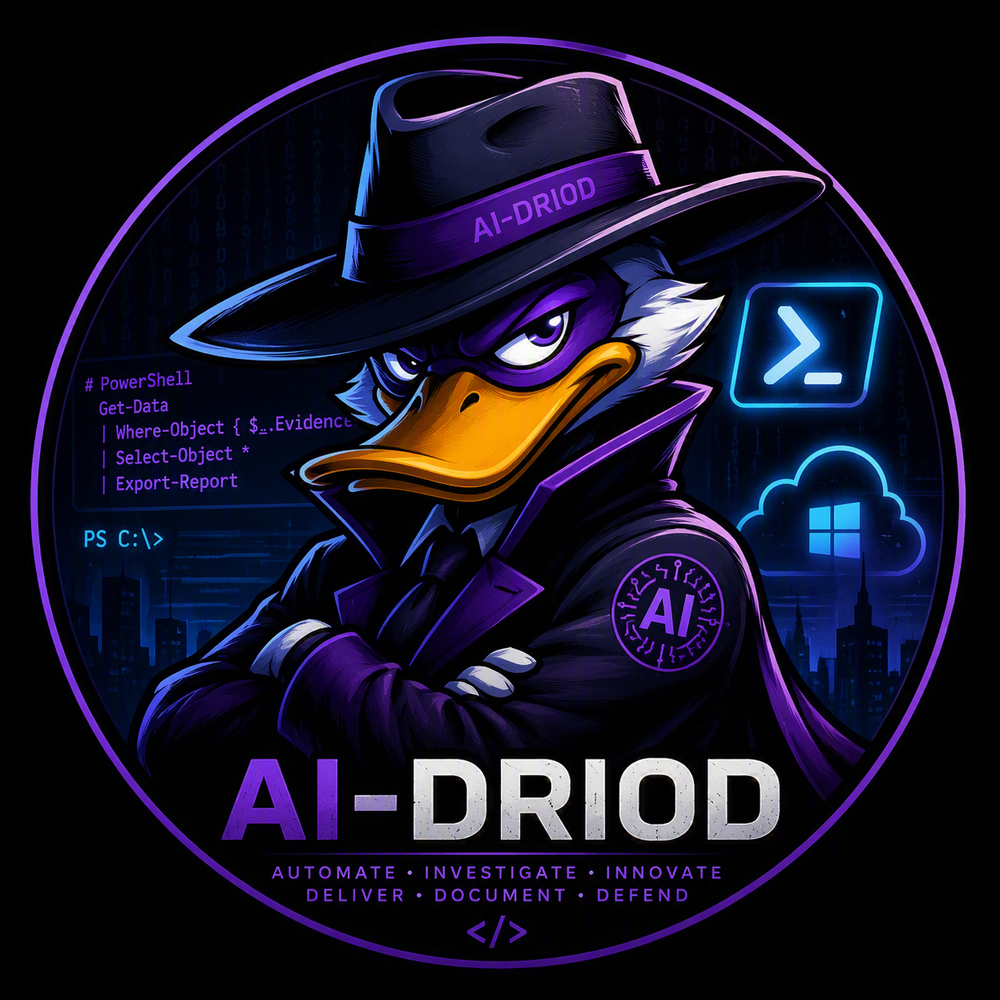

# 👋 Hi, I'm Marten Theunissen

> Technical Specialist | Microsoft 365 | Azure | Intune | Exchange Online | Security | Automation


---

## 🧠 About Me

## 🔭 Current Focus

- Microsoft 365
- Azure Engineering
- Intune Architecture
- PowerShell Automation
- Security & Compliance
- Root Cause Analysis
- AI-Assisted Operations

I'm a Technical Specialist focused on Microsoft cloud platforms, infrastructure, endpoint management, security, automation and enterprise troubleshooting.

My approach is simple:

- Evidence beats theory
- Read-only before write
- Root cause before workaround
- Automate repetitive tasks
- Document everything

I specialise in solving complex technical issues, building operational tooling, and transforming investigations into repeatable processes.

---

## ☁️ Core Technologies

### Microsoft Cloud
- Microsoft 365
- Azure
- Entra ID
- Azure Virtual Desktop
- Exchange Online
- SharePoint Online
- Microsoft Teams

### Endpoint Management
- Microsoft Intune
- Windows Autopilot
- Device Compliance
- Endpoint Security
- Conditional Access

### Security
- Microsoft Defender
- Identity Protection
- Security Baselines
- Zero Trust Principles
- Security Hardening

### Automation
- PowerShell
- Azure Automation
- Scripting & Tooling
- Operational Frameworks
- Evidence Collection Systems

---

## 🔧 Current Areas of Interest

- Cloud Operations
- Infrastructure Automation
- Endpoint Modernisation
- Microsoft Security
- AI-Assisted Operations
- Enterprise Troubleshooting
- Technical Documentation
- Process Optimisation

---

## 📂 Featured Repositories

### PowerShell
Scripts, automation and operational tooling.

### Intune
Endpoint management, policy deployment and configuration examples.

### Azure
Cloud administration, investigations and automation.

### Security
Hardening, auditing and compliance tooling.

### Case Studies
Real-world troubleshooting and root cause analysis write-ups.

---

## 📈 Professional Philosophy

```powershell
$Principles = @(
    "Evidence beats theory"
    "Trust logs, not assumptions"
    "Automate repetitive work"
    "Root cause > Workaround"
    "Document everything"
)

$Principles | Export-Report
```

---

## 🤖 AI-driod

AI-driod represents my approach to engineering:

**Automate • Investigate • Innovate**

**Deliver • Document • Defend**

---

## 📫 Connect

- GitHub: @Ai-driod
- LinkedIn: Coming Soon

---

> Created and Compiled by Marten Theunissen and his AI sidekick
